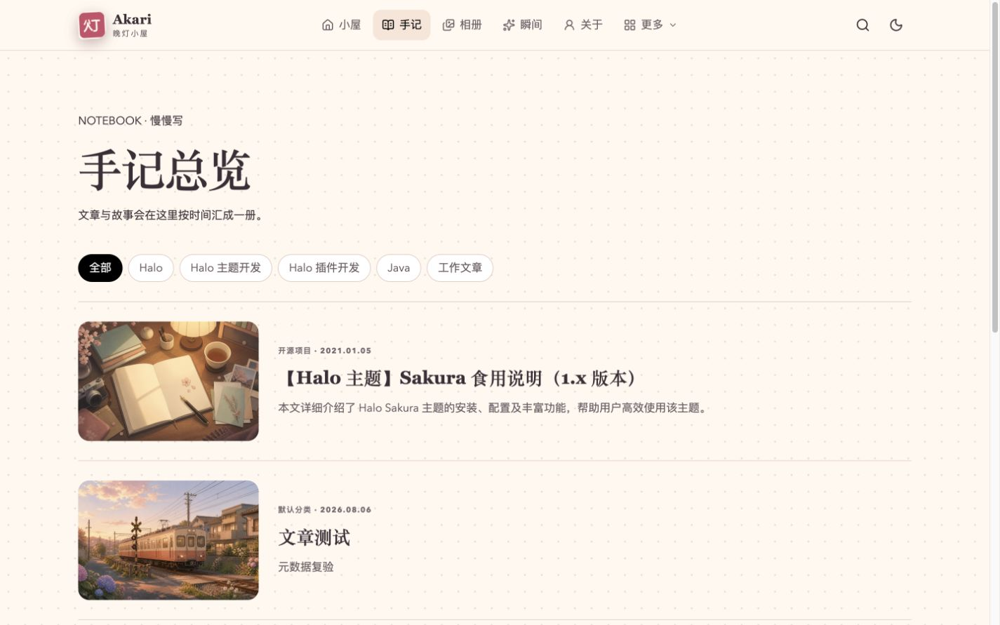
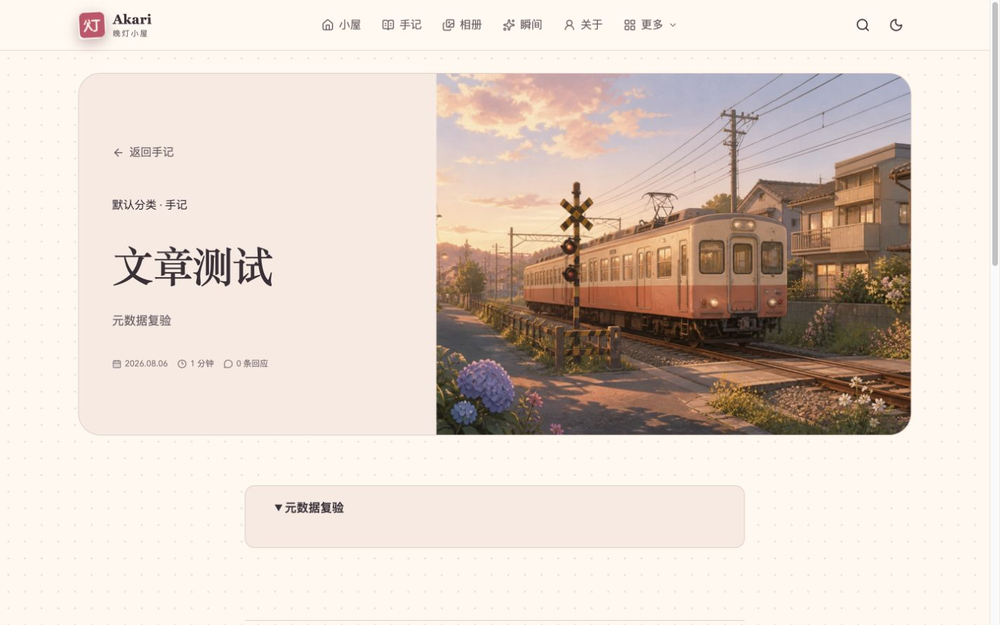
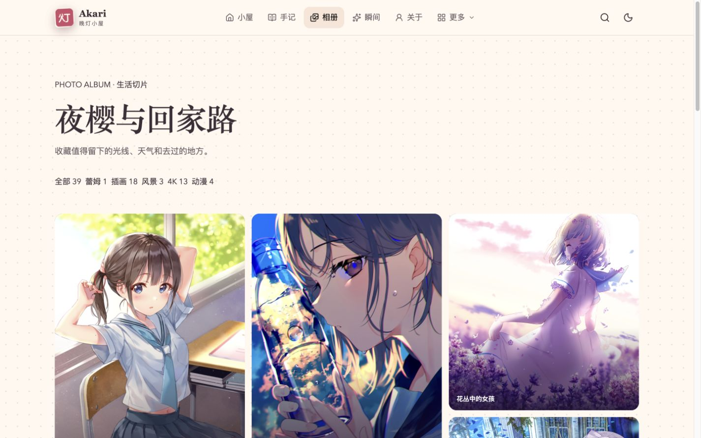
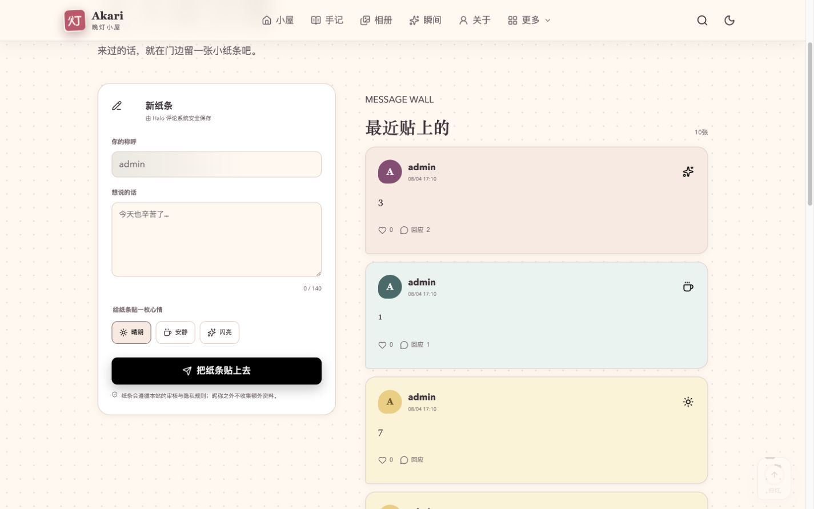

  

<h1 align="center">晚灯小屋 Akari</h1>

  把文章、声音与生活切片，慢慢收进一间温暖的小屋。

  <a href="https://www.halo.run/store/apps/app-8rojpuw1">Halo 应用市场</a>
  ·
  <a href="./docs/USER_GUIDE.md">主题使用说明</a>
  ·
  <a href="#页面预览">页面预览</a>
  ·
  <a href="https://github.com/LIlGG/theme-akari/issues">问题反馈</a>

  

Akari 是一款为个人博客设计的 Halo 主题。不将博客做成整齐划一的内容货架，而是把手记、照片、瞬间、书影音和来访者的纸条组织成一间有生活痕迹的小屋。

> Akari 从设计、实现到验证均由 Agent 全程辅助开发，并由维护者持续审阅与打磨。

## 主题特性

- **一张会呼吸的首页**：主视觉、最近生活拼贴、正在播放、书架、最新手记与媒体房间共同组成首页叙事。
- **适合慢慢阅读**：文章页包含阅读时间、分层目录、正文排版、随文音视频、回应区与回到顶部。
- **丰富但不杂乱的媒体体验**：支持音频、视频、相册灯箱、瞬间、媒体札记，以及跨页面不中断的常驻播放器。
- **完整的内容房间**：手记、归档、分类与标签、关于、媒体室、相册、瞬间、友链和留言簿都拥有独立设计。
- **从宽屏到手机都舒适**：桌面、平板与移动端采用不同的信息密度；同时支持明亮、深色和跟随系统。
- **多语言界面**：内置简体中文、繁体中文、日语和英文界面文案。

## 页面预览

<table>
  <tr>
    <td width="50%">
      
      
<strong>手记总览</strong> 按分类或标签翻阅，局部更新文章列表。

    </td>
    <td width="50%">
      
      
<strong>文章阅读</strong> 封面叙事、阅读时间、目录与主题化回应。

    </td>
  </tr>
  <tr>
    <td width="50%">
      
      
<strong>生活切片</strong> 动态分组、自然排版与沉浸式灯箱。

    </td>
    <td width="50%">
      
      
<strong>玄关留言簿</strong> 把 Halo 评论变成一面有心情的纸条墙。

    </td>
  </tr>
</table>

## 内容从哪里来

| 区域                           | 内容来源                                  |
| ------------------------------ | ----------------------------------------- |
| 首页主视觉                     | 主题设置中的文案、背景与角色图            |
| 屋主信息与最近状态             | 最新文章的作者资料与最近发布文章          |
| 最近生活拼贴、最近写下的       | Halo 中最新发布的文章                     |
| 正在播放、我的书架             | 主题设置选中的文章及文章的 Akari 媒体字段 |
| 手记、归档、分类与标签         | Halo 文章、分类和标签                     |
| 关于、媒体室、留言簿、友邻门牌 | 选择了对应 Akari 模板的自定义页面         |
| 相册、瞬间、友链、搜索与评论   | 对应 Halo 插件提供的真实数据              |

## 开始使用

Akari 适用于 **Halo 2.25 或更高版本**。

1. 从 [Halo 应用市场](https://www.halo.run/store/apps/app-8rojpuw1) 安装，或从 GitHub Release 下载主题 ZIP。
2. 在 Halo Console 中进入 **外观 → 主题**，安装并启用 **晚灯小屋 Akari**。
3. 在主题设置中填写小屋身份、首页主视觉、内容来源、配色与页脚。
4. 创建需要的自定义页面，并在页面高级设置中选择对应的 Akari 模板。
5. 创建主菜单，把这些页面和已安装插件的入口放进导航。

从空白站点配置到完整效果，请阅读 [《晚灯小屋 Akari 主题使用说明》](./docs/USER_GUIDE.md)。其中包含推荐配置顺序、自定义页面、菜单、文章媒体字段、插件与上线检查清单。

## 推荐插件

主题的文章、归档、分类、标签和普通页面不依赖插件。下面的能力会在插件安装并启用后出现；未安装的房间不会影响核心阅读体验。

| 插件                                                  | 为 Akari 提供的能力        | 是否必需         |
| ----------------------------------------------------- | -------------------------- | ---------------- |
| [评论组件](https://www.halo.run/store/apps/app-YXyaD) | 文章回应、留言簿与内容评论 | 想使用评论时必需 |
| [图库管理](https://www.halo.run/store/apps/app-BmQJW) | 相册列表、分组、详情与灯箱 | 可选             |
| [瞬间](https://www.halo.run/store/apps/app-SnwWD)     | 瞬间列表、详情与回应       | 可选             |
| [链接管理](https://www.halo.run/store/apps/app-hfbQg) | 友链分组、站点信息与状态   | 可选             |
| [搜索组件](https://www.halo.run/store/apps/app-DlacW) | 页眉搜索与搜索结果页       | 可选             |

> 只为实际启用的页面创建菜单项。例如没有安装图库管理时，不要在菜单中添加 `/photos`。

## 一点使用建议

- 首页主视觉最适合 **4:3、长边至少 1440 px、主体靠右** 的图片；角色图建议使用透明 PNG 或 WebP。
- 每篇文章尽量填写封面、摘要和分类。这样首页卡片、归档和筛选页会更完整。
- 媒体内容使用“媒体札记”文章模板，并填写文章编辑页中的 Akari 媒体字段；不要把音视频地址写进普通文本。
- 导航建议保留 4–5 个常用入口，其余收纳进“更多”，让页眉保持呼吸感。
- 开启访客天气前，请阅读使用说明中的隐私提示；不需要时可以直接关闭。

## 支持与许可

使用中遇到可以稳定复现的问题，请通过 [GitHub Issues](https://github.com/LIlGG/theme-akari/issues) 反馈，并附上 Halo 版本、主题版本、相关插件版本和复现步骤。涉及安全风险的内容不要公开粘贴敏感站点数据。
